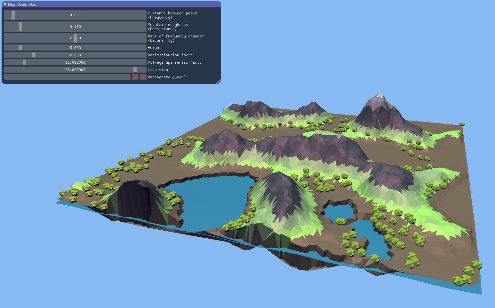
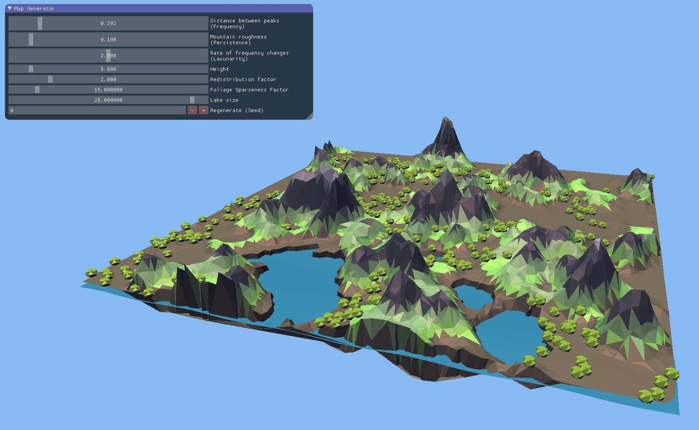
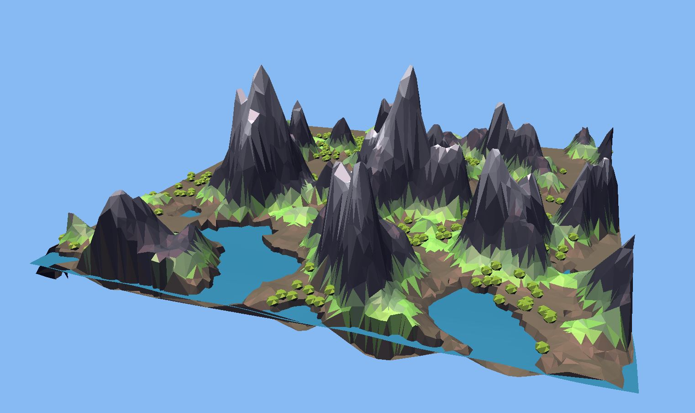
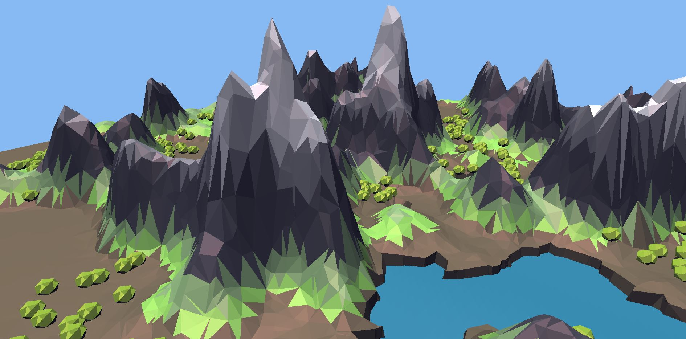
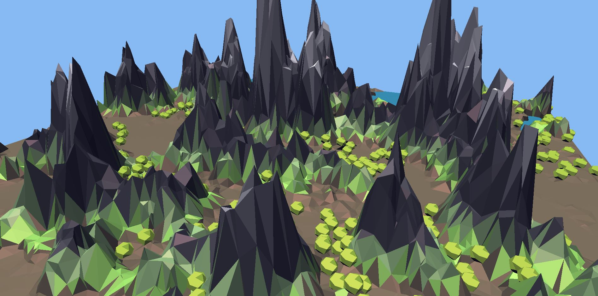
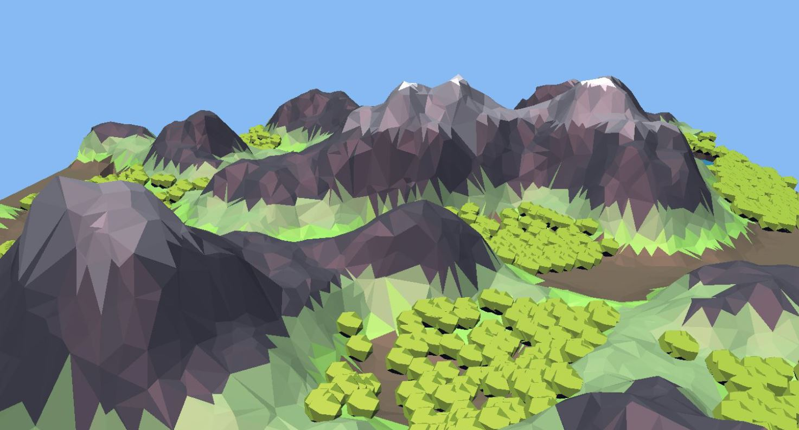

# Project_Polly
## Abstract
Procedural generation is a powerful tool for creating virtual worlds to explore. Project Polly explores procedurally
generating low-poly terrain and structures in a scene akin to a game map. With a rise in interest in the stylistic rendering
of games like Monument Valley, the scene was intended to be designed to resemble their artistic style.
We aim to address the challenge of generating scenes in this stylistic low-poly manner as well as allow users to
interactively generate various types of terrains via editing parameters.

### Overall objective and problem definition
The generated terrain needs to successfully achieve the desired low-poly visuals. It must also be capable of presenting
variations of regions such as mountains, ground and lakes. Foliage must be placed appropriately. The overall goal is to
produce a scene with adequate enough variety to make its exploration interesting. To achieve this goal, three main
challenges were addressed: how to generate a low-poly triangle terrain mesh, how to represent a variation in terrain
heights and how to place additional models in appropriate locations in the scene.

### Solutions and Implementation Details 
#### 1.0 Generation of low-polygon triangle terrain mesh
Mesh generation was done using Delaunay triangulation of a set of randomly generated points. Delaunay triangulation
gives a more “random” effect which creates a better overall low poly style look. The Bowyer-Watson algorithm was used
for computing the Delaunay triangulation.
Bowyer-Watson pseudocode:
```
triangles = []
add super_triangle to triangles
for each point:
  edges = []
  bad_triangles = []
  for each triangle in triangles:
    if point is in circumcircle of triangle:
      add triangle to bad_triangles
      add triangle edges to edges
  remove all bad_triangles from triangles
  remove duplicate edges in edges
  for each edge in edges:
    create a new triangle with vertices,(edge.a, edge.b, point)
    add the new triangle to triangles
```
#### 2.0 Creating the height map
The height map was generated by combining several Perlin noise maps with different frequencies and persistences with a
constant weight, and then redistributing the height by raising the the elevation to a power. The exponent factor pushes the
middle elevation down into plateaus and lower values pull middle elevation up into mountain peaks.
```
height = 1.0 * noise_1(x, y) + 1.5 * noise_2(x, y) + 0.15 * noise_3(x, y)
height = height ^ e
```
#### 3.0 Adding foliages
Foliage was randomly spread across the scene, cohering to tree concentrations similar to forest patches. An additional
noise map was generated using a Perlin noise map to determine foliage placements. Sparseness factor is a value that
can be adjusted by the user to control the sparsity of the foliages in the scene.
```
noise // Generate a foliage noise map
for i:=0 to all_vertices.size, step sparseness_factor:
  point = all_vertices[i]
  Calculate the maximum noise inside a circle of center point and radius=0.1
  if noise value at point is the maximum of the circle:
      place a foliage at point
```
#### 4.0 Adding lake and fluid simulation
A lake was added to fill half the map, with its elevation determined by another Perlin noise map. A height of less than 0
pushed the lake down. It also has a simple fluid simulation animation which is calculated through a combination of sine
and cosine equations.
```
noise // Generate a lake noise map.
// Height map calculation.
…
if(height <= 0):
  height = height - noise(x, y)
```
#### 5.0 Shading
Flat shading, where each triangle is assigned only one colour, created a better stylized low-poly scene than interpolation,
where the difference between normals of different triangles were used to smooth over the edges. Flat shading was
implemented by using a flat interpolation specifier when passing attributes from the vertex shader to the fragment shader.
Each triangle was shaded with a colour corresponding to its height, calculated using height maps, to visually signify
mountains and lakes.

### Results 










